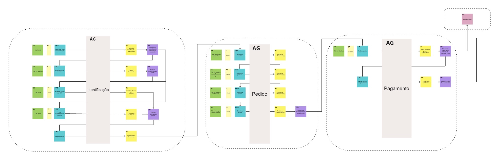
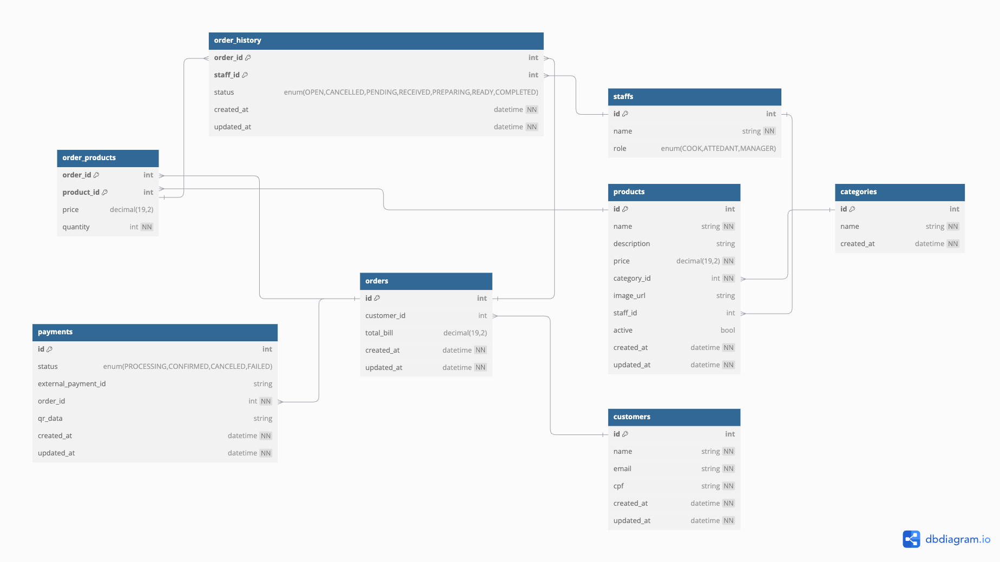

<a name="readme-top"></a>


# <p align="center">FIAP Tech Challenge-1 - G20 Fast Food</p>

<p align="center">
    
    
    
    
    
    
</p>

## 💬 About

Repository for the [FIAP](https://postech.fiap.com.br/) Tech Challenge 1, focused on developing a monolith backend system for managing orders in a fast-food restaurant.

Tech Challenge 1 specifications can be found [here](docs/tc1-spec.pdf).

## 📚 Dictionary - Ubiquitous Language

- Customer (actor): Actor responsible for initiating the purchasing process
- Cook (actor): Actor responsible for preparing the customer's order
- Attendant (actor): Actor responsible for interacting with the customer, providing support for the order
- Identification method: Format in which the customer is identified on the platform: via CPF or anonymous.
- Identification: Customer identification on the platform
- Authorization: Grants permission to the customer to perform operations on the platform, such as placing an order, changing registration information
- Order: Represents all items selected by the customer in the store
- Order Status: Represents the stage of order preparation after payment is confirmed.

<!-- Diagrams -->
## 📊 Diagrams

### Event Storming - Order & Payment


### Event Storming - Preparation & Delivery


Full Event Storming Board can be found [here](https://miro.com/app/board/uXjVLJzdySo=/?share_link_id=228486775564).

<!-- Database -->
## 📦 Database


### :card_file_box: Database Schema


DBML file can be found [here](docs/db-schema-g20-fast-food.dbml).

### :open_file_folder: Project Structure

```
.
├── bin
├── cmd
│   └── http
├── docs
└── internal
    ├── adapter
    │   ├── handler
    │   │   └── http
    │   ├── repository
    │       └── postgres
    │           └── migrations
    └── core
        ├── domain
        ├── port
        ├── service
        └── util

```


<details>
<summary>Project Structure Explanation</summary>

- `bin`: directory to store compiled executable binary.
- `docs`: directory to store project's documentation, such as swagger static files.
- `cmd`: directory for main entry points or commands of the application. The http sub-directory holds the main HTTP server entry point.
- `internal`: directory for containing application code that should not exposed to external packages.
- `core`: directory that contains the central business logic of the application. Inside it there are 4 sub-directories.
- `domain`: directory that contains domain models/entities representing core business concepts.
- `port`: directory that contains defined interfaces or contracts that adapters must follow.
- `service`: directory that contains the business logic or services of the application.
- `util`: directory that contains utility functions that reused in the service package.
- `adapters`: directory for containing external services that will interact with the core of application. There are 4 external services used in this application.
- `handler/http`: directory that contains HTTP request and response handler.
- `repository/postgres`: directory that contains database adapters for PostgreSQL.

</details>

### 🧐 Decisions

1. **Language**: We chose Go as the programming language for its performance, simplicity, and concurrency features.
2. **Framework**: We chose the Gin framework for its simplicity and performance.
3. **Database**: We chose PostgreSQL as the database for its performance, scalability, and reliability.

### ✨ Features
- [x] Dockerfile: small image with multi-stage docker build, and independent of the host environment
- [x] Makefile: to simplify the build and run commands
- [x] Hexagonal architecture
- [x] PostgreSQL database
- [x] Conventional commits
- [x] Unit tests
- [x] Code coverage
- [x] Swagger documentation
- [x] Feature branch workflow
- [x] Air to run go
- [x] Pagination


## :computer: Technologies

- [Go](https://golang.org/)
- [Gin](https://github.com/gin-gonic/gin)
- [golangci-lint](https://golangci-lint.run/)
- [Docker](https://www.docker.com/)
- [PostgreSQL](https://www.postgresql.org/)
- [Make](https://www.gnu.org/software/make/)
- [Air](https://github.com/air-verse/air)
- [Uber FX](https://github.com/uber-go/fx)
- [GORM](https://gorm.io/)
- [Testify](https://github.com/stretchr/testify)
- [Swag](https://github.com/swaggo/swag)
- [GoDotEnv](https://github.com/joho/godotenv)
- [Slog](https://go.dev/blog/slog)


<p align="right">(<a href="#readme-top">back to top</a>)</p>

## :scroll: Requirements

### Build/Run with Docker

- [Docker](https://www.docker.com/)

### Build/Run Locally

- [Go](https://golang.org/)
- [Docker](https://www.docker.com/)

> [!NOTE]
> You need to have Go (> 1.18) installed in your machine to build, run and test the application locally

<p align="right">(<a href="#readme-top">back to top</a>)</p>

## :cd: Installation

```sh
git clone https://github.com/FIAP-SOAT-G20/FIAP-TechChallenge-Fase1.git
```

```sh
cd FIAP-TechChallenge-Fase1
```

[Optional] Set the environment variables
```sh
cp .env.example .env
```
> [!NOTE]
> If you want to run the application locally, you need to set the environment variables in the `.env` file  
> If you want to run the application using Docker, you don't need to set the environment variables because they are already set in the `.env.local` file used by Docker Compose  

### :whale: Docker

```sh
make compose-build
```
> The binary will be created in the `bin` folder

<p align="right">(<a href="#readme-top">back to top</a>)</p>

## :runner: Running

### :whale: Docker

```sh
make compose-run
```

> [!NOTE]
> To stop the application, run `compose-stop`
> To remove the application, run `compose-clean`

<p align="right">(<a href="#readme-top">back to top</a>)</p>

## :rocket: Routes

### sign-up (2.b: i.Cadastro do Cliente)
**POST** `/api/v1/customers` - Create a customer  
**POST** `/api/v1/staffs` - Create a staff  

---

### products (2.b: iii. Criar, editar e remover produtos;)
**POST** `/api/v1/payments/callback` - Update a payment on a order  
**POST** `/api/v1/payments/{order_id}/checkout` - Create a checkout on a order  
**GET** `/api/v1/products` - List products  
**POST** `/api/v1/products` - Create a product  
**GET** `/api/v1/products/{id}` - Get a product (2.b: iv. Buscar produtos por categoria;)  
**PUT** `/api/v1/products/{id}` - Update a product  
**DELETE** `/api/v1/products/{id}` - Delete a product  

---

### payments (2.b: v. Fake checkout)
**POST** `/api/v1/payments/callback` - Update a payment on a order  
**POST** `/api/v1/payments/{order_id}/checkout` - Create a checkout on a order  

---

### sign-in (2.b: ii. Identificação do Cliente via CPF)
**POST** `/api/v1/sign`-in - Sign in a customer  

---

### categories
**GET** `/api/v1/categories` - List categories  
**POST** `/api/v1/categories` - Create a new category  
**GET** `/api/v1/categories/{id}` - Get a category  
**PUT** `/api/v1/categories/{id}` - Update a category  
**DELETE** `/api/v1/categories/{id}` - Delete a category  

---

### customers
**GET** `/api/v1/customers` - List customers  
**POST** `/api/v1/customers` - Create a customer  
**GET** `/api/v1/customers/{id}` - Get a customer  
**PUT** `/api/v1/customers/{id}` - Update a customer  
**DELETE** `/api/v1/customers/{id}` - Delete a customer  

---

### orders
**GET** `/api/v1/orders` - List orders (2.b: vi. Listar os pedidos.)  
**POST** `/api/v1/orders` - Create an order  
**GET** `/api/v1/orders/products/{order_id}/{product_id}` - Get an order product  
**PUT** `/api/v1/orders/products/{o`rder_id}/{product_id} - Update an order product  
**POST** `/api/v1/orders/products/{order_id}/{product_id}` - Create an order product  
**DELETE** `/api/v1/orders/products/{o`rder_id}/{product_id} - Delete an order product  
**PUT** `/api/v1/orders/status/{id}` - Update an order status  
**GET** `/api/v1/orders/{id}` - Get an order  
**DELETE** `/api/v1/orders/{id}` - Delete an order  

---

### order-histories
**GET** `/api/v1/orders/histories` - List order histories  
**GET** `/api/v1/orders/histories/{id}` - Get an order history  
**GET** `/api/v1/orders/products` - List order products  

---

### staffs
**GET** `/api/v1/staffs` - List staffs  
**POST** `/api/v1/staffs` - Create a staff  
**GET** `/api/v1/staffs/{id}` - Get a staff  
**PUT** `/api/v1/staffs/{id}` - Update a staff  
**DELETE** `/api/v1/staffs/{id}` - Delete a staff  

---

### healthcheck
**GET** `/health - Application` HealthCheck  
> Returns http status `200` if the application is running  
> Returns http status `503` if the application or any of its dependencies are not running appropriately  
> Follows the [Health Check Response Format for HTTP APIs](https://datatracker.ietf.org/doc/html/draft-inadarei-api-health-check-06)
---

> [!NOTE]
> You can check the application swagger documentation at http://localhost:8080/docs/index.html  
> Alternatively, a postman collection is available at [here](docs/10soat-g20-tech-challenge-1.postman_collection.json)  

<p align="right">(<a href="#readme-top">back to top</a>)</p>

## :hammer_and_wrench: Development

1. Install Go: https://golang.org/doc/install
2. Clone this repository: `git clone https://github.com/FIAP-SOAT-G20/FIAP-TechChallenge-Fase1`
3. Change to the project directory: `cd FIAP-TechChallenge-Fase1`
4. Set the environment variables: `cp .env.example .env`
3. Install dependencies by running `make build`
4. Run the application by running `make run-air` or `make run`

> [!NOTE]
> `make run` will run the application locally, and will build and run PostgreSQL container using Docker Compose  
> Alternatively, you can run `make run-air` to run the application using Air (live reload) 

<p align="right">(<a href="#readme-top">back to top</a>)</p>


## :white_check_mark: Tests

```sh
make test
```
> [!NOTE]
> It will run the unit tests and generate the coverage report as `coverage.out`  
> You can check the coverage report by running `make coverage`  

<p align="right">(<a href="#readme-top">back to top</a>)</p>

## :clap: Acknowledgments

- [Hexagonal Architecture, Ports and Adapters in Go](https://medium.com/@kyodo-tech/hexagonal-architecture-ports-and-adapters-in-go-f1af950726b)
- [Building RESTful API with Hexagonal Architecture in Go](https://dev.to/bagashiz/building-restful-api-with-hexagonal-architecture-in-go-1mij)
- [DBML](https://www.dbml.org/)
- [Health Check Response Format for HTTP APIs](https://datatracker.ietf.org/doc/html/draft-inadarei-api-health-check-06)
- [Event Storming](https://www.eventstorming.com/)
- [Swagger](https://swagger.io/)
- [Conventional Commits](https://www.conventionalcommits.org/en/v1.0.0/)
- [Shields.io](https://shields.io/)

<p align="right">(<a href="#readme-top">back to top</a>)</p>

## :busts_in_silhouette: Contributors

<table>
  <tbody>
    <tr>
      <td align="center" valign="top" width="14.28%"><a href="https://github.com/atomaz"><br /><sub><b>Alice Tomaz</b></sub></a><br />
      <td align="center" valign="top" width="14.28%"><a href="https://github.com/filipe1309"><br /><sub><b>Filipe Leuch Bonfim</b></sub></a><br />
      <td align="center" valign="top" width="14.28%"><a href="https://github.com/hugokishi"><br /><sub><b>Hugo Kishi</b></sub></a><br />
      <td align="center" valign="top" width="14.28%"><a href="https://github.com/marcos-nsantos"><br /><sub><b>Marcos Santos</b></sub></a><br />
      <td align="center" valign="top" width="14.28%"><a href="https://github.com/vitorparras"><br /><sub><b>Vitor Parras</b></sub></a><br />
    </tr>
  </tbody>
</table>

<p align="right">(<a href="#readme-top">back to top</a>)</p>
