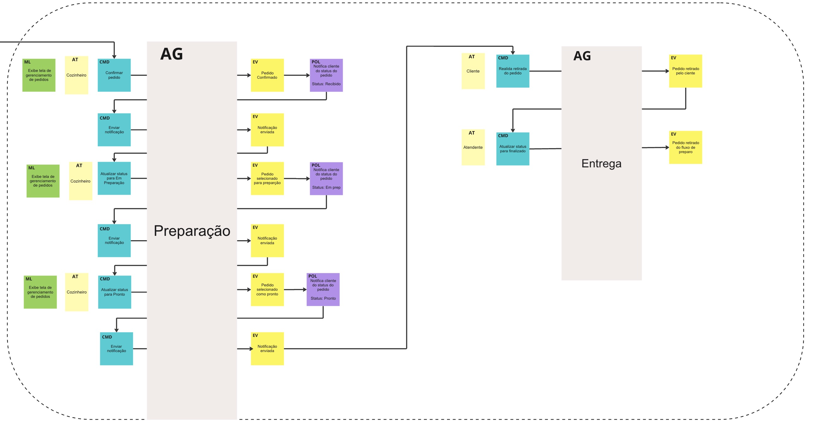

<a name="readme-top"></a>

# <p align="center">FIAP Tech Challenge-1 - G20 Fast Food</p>

<p align="center">
    
    
</p>

## 💬 About

Repository for the [FIAP](https://postech.fiap.com.br/) Tech Challenge 1, focused on developing a monolith backend system for managing orders in a fast-food restaurant.

Tech Challenge 1 specifications can be found [here](docs/tc1-spec.pdf).

## 📚 Dictionary - Ubiquitous Language

- Customer (actor): Actor responsible for initiating the purchasing process
- Cook (actor): Actor responsible for preparing the customer's order
- Attendant (actor): Actor responsible for interacting with the customer, providing support for the order
- Identification method: Format in which the customer is identified on the platform: via CPF or anonymous.
- Identification: Customer identification on the platform
- Authorization: Grants permission to the customer to perform operations on the platform, such as placing an order, changing registration information
- Order: Represents all items selected by the customer in the store
- Order Status: Represents the stage of order preparation after payment is confirmed.

<!-- Diagrams -->
## 📊 Diagrams

### Event Storming - Order & Payment


### Event Storming - Preparation & Delivery


Full Event Storming Board can be found [here](https://miro.com/app/board/uXjVLJzdySo=/?share_link_id=228486775564).

<!-- Database -->
## 📦 Database


### :card_file_box: Database Schema


DBML file can be found [here](docs/db-schema-g20-fast-food.dbml).

### :open_file_folder: Project Structure

```
.
├── bin
├── cmd
│   └── http
├── docs
└── internal
    ├── adapter
    │   ├── handler
    │   │   └── http
    │   ├── repository
    │       └── postgres
    │           └── migrations
    └── core
        ├── domain
        ├── port
        ├── service
        └── util

```

- `bin`: directory to store compiled executable binary.
- `docs`: directory to store project's documentation, such as swagger static files.
- `cmd`: directory for main entry points or commands of the application. The http sub-directory holds the main HTTP server entry point.
- `internal`: directory for containing application code that should not exposed to external packages.
- `core`: directory that contains the central business logic of the application. Inside it there are 4 sub-directories.
- `domain`: directory that contains domain models/entities representing core business concepts.
- `port`: directory that contains defined interfaces or contracts that adapters must follow.
- `service`: directory that contains the business logic or services of the application.
- `util`: directory that contains utility functions that reused in the service package.
- `adapters`: directory for containing external services that will interact with the core of application. There are 4 external services used in this application.
- `handler/http`: directory that contains HTTP request and response handler.
- `repository/postgres`: directory that contains database adapters for PostgreSQL.

### :pushpin: Decisions

- We chose Go as the programming language for its performance, simplicity, and concurrency features.
- We chose the Gin framework for its simplicity and performance.
- We chose PostgreSQL as the database for its performance, scalability, and reliability.

### :pushpin: Features
- [x] Dockerfile: small image with multi-stage docker build, and independent of the host environment
- [x] Makefile: to simplify the build and run commands
- [x] Hexagonal architecture
- [x] PostgreSQL database
- [x] Conventional commits
- [x] Unit tests
- [x] Code coverage
- [x] Swagger documentation
- [x] Feature branch workflow
- [x] Air to run go
- [x] Pagination


## :computer: Technologies

- [Go](https://golang.org/)
- [Gin](https://github.com/gin-gonic/gin)
- [Docker](https://www.docker.com/)
- [PostgreSQL](https://www.postgresql.org/)
- [Make](https://www.gnu.org/software/make/)
- [Air](https://github.com/air-verse/air)
- [Uber FX](https://github.com/uber-go/fx)
- [GORM](https://gorm.io/)
- [Testify](https://github.com/stretchr/testify)
- [Swag](https://github.com/swaggo/swag)
- [GoDotEnv](https://github.com/joho/godotenv)
- [Slog](https://go.dev/blog/slog)


<p align="right">(<a href="#readme-top">back to top</a>)</p>

## :scroll: Requirements

### Build/Run with Docker

- [Docker](https://www.docker.com/)

### Build/Run Locally

- [Go](https://golang.org/)

> [!NOTE]
> You need to have Go (> 1.18) installed in your machine to build, run and test the application locally

<p align="right">(<a href="#readme-top">back to top</a>)</p>

## :cd: Installation

```sh
git clone git@github.com/FIAP-SOAT-G20/FIAP-TechChallenge-Fase1.git
```

```sh
cd FIAP-TechChallenge-Fase1
```

```sh
cp .env.example .env
```

### :whale: Docker

```sh
make compose-build
```

### :hammer: Build (build locally)

```sh
make build
```
> The binary will be created in the `bin` folder

<p align="right">(<a href="#readme-top">back to top</a>)</p>

## :runner: Running

### :whale: Docker

```sh
make run-compose
```

### :hammer: Build (run locally)

```sh
make run
```

> [!NOTE]
> `make run` will run the application locally, and will build and run PostgreSQL container using Docker Compose  
> Alternatively, you can run `make run-air` to run the application using Air (live reload)  

<p align="right">(<a href="#readme-top">back to top</a>)</p>

<!-- routes -->
## :rocket: Routes

### :white_check_mark: Endpoints


- **GET** `/docs/index.html`: Swagger documentation
- **GET** `/healthCheck`
---
- **POST** `api/v1/customers`: Create a new customer
- **GET** `api/v1/customers`: List all customers
- **GET** `api/v1/customers/:id`: Get a customer by ID
- **PUT** `api/v1/customers/:id`: Update a customer by ID
- **DELETE** `api/v1/customers/:id`: Delete a customer by ID
---
- **POST** `api/v1/products`: Create a new product
- **GET** `api/v1/products`: List all products
- **GET** `api/v1/products/:id`: Get a product by ID
- **PUT** `api/v1/products/:id`: Update a product by ID
- **DELETE** `api/v1/products/:id`: Delete a product by ID
---
- **POST** `api/v1/catagories`: Create a new category
- **GET** `api/v1/catagories`: List all categories
- **GET** `api/v1/catagories/:id`: Get a category by ID
- **PUT** `api/v1/catagories/:id`: Update a category by ID
- **DELETE** `api/v1/catagories/:id`: Delete a category by ID
---
- **POST** `api/v1/orders`: Create a new order
- **GET** `api/v1/orders`: List all orders
- **GET** `api/v1/orders/:id`: Get an order by ID
- **PUT** `api/v1/orders/:id`: Update an order by ID
- **DELETE** `api/v1/orders/:id`: Delete an order by ID
---
- **POST** `/api/v1/payments/:orderId/checkout`: Create a new payment
- **GET** `/api/v1/payments/callback`: Payment callback
---
- **POST** `/api/v1/sign-in`: Sign in a customer with CPF
---

> [!NOTE]
> You can check the application swagger documentation at `http://localhost:8080/docs/index.html`  
> A postman collection is available at `docs/10soat-g20-tech-challenge-1.postman_collection.json`  

<p align="right">(<a href="#readme-top">back to top</a>)</p>

## :white_check_mark: Tests

```sh
make test
```
> It will run the unit tests and generate the coverage report as `coverage.out`  
> You can check the coverage report by running `make coverage`

## :clap: Acknowledgments

- [Hexagonal Architecture, Ports and Adapters in Go](https://medium.com/@kyodo-tech/hexagonal-architecture-ports-and-adapters-in-go-f1af950726b)
- [Building RESTful API with Hexagonal Architecture in Go](https://dev.to/bagashiz/building-restful-api-with-hexagonal-architecture-in-go-1mij)
- [DBML](https://www.dbml.org/)
- [Uber FX](https://github.com/uber-go/fx)

<p align="right">(<a href="#readme-top">back to top</a>)</p>

## :busts_in_silhouette: Contributors

<table>
  <tbody>
    <tr>
      <td align="center" valign="top" width="14.28%"><a href="https://github.com/atomaz"><br /><sub><b>Alice Tomaz</b></sub></a><br />
      <td align="center" valign="top" width="14.28%"><a href="https://github.com/filipe1309"><br /><sub><b>Filipe Leuch Bonfim</b></sub></a><br />
      <td align="center" valign="top" width="14.28%"><a href="https://github.com/hugokishi"><br /><sub><b>Hugo Kishi</b></sub></a><br />
      <td align="center" valign="top" width="14.28%"><a href="https://github.com/marcos-nsantos"><br /><sub><b>Marcos Santos</b></sub></a><br />
      <td align="center" valign="top" width="14.28%"><a href="https://github.com/vitorparras"><br /><sub><b>Vitor Parras</b></sub></a><br />
    </tr>
  </tbody>
</table>

<p align="right">(<a href="#readme-top">back to top</a>)</p>
